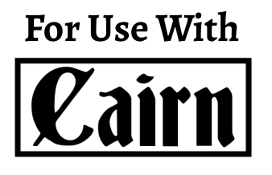

<div>
  <h1 align="center">OSR Tools</h1>
  <strong>
    A collection of tools and generators for <a href="https://en.wikipedia.org/wiki/Old_School_Renaissance">OSR-style</a> TTRPG
  </strong>

  <div
    style="display: flex; flex-wrap: wrap;justify-content: space-evenly; align-items: center; background-color: #ffe647; padding: 10px 10px;"
  >
    
    <a href="https://necroticgnome.com/">
      
    </a>
      <a href="https://cairnrpg.com/">
      
    </a>
      <a href="https://morkborg.com/">
      
    </a>
    <a href="https://www.thearcanelibrary.com/pages/shadowdark">
      
    </a>
  </div>
</div>

<hr />


## Features

- [ ] Character Generators
  - [x] [Knave](https://www.drivethrurpg.com/product/250888/Knave)
  - [ ] [Cairn](https://cairnrpg.com/)
  - [ ] [Old School Essentials](https://necroticgnome.com/) (B/X D&D)
  - [ ] [Shadowdark RPG](https://www.thearcanelibrary.com/pages/shadowdark)
  - [ ] [MÖRK BORG](https://morkborg.com/)
- [ ] Dungeon Generators

## Getting Started

Pre-requisites:

- [Nodejs](https://nodejs.org/en/)
- [yarn](https://yarnpkg.com/)

Clone the repo:

```zsh
git clone https://github.com/riccjohn/osr-tools

cd osr-tools/
```

Install the correct Node version.

The project's current node version is listed in the `.tool-versions` file. If you're using a node version manager like [asdf](https://asdf-vm.com/) with the [asdf nodejs plugin](https://github.com/asdf-vm/asdf-nodejs), you should be able to run `asdf install` to get the correct version.

**Install dependencies**

```zsh
yarn install
```

**Start the development server**

```zsh
yarn dev
```

Open [http://localhost:3000](http://localhost:3000) with your browser to see the result.

**Tests**

```zsh
yarn test
```

**Linter**

```zsh
yarn lint
```
